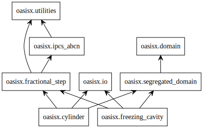

# OasisX
## Description
This repository aims to be a new implementation of [Oasis](https://github.com/mikaem/Oasis), using the algorithms described in the [Oasis paper](https://www.sciencedirect.com/science/article/pii/S0010465514003786). For now only the [cylinder example](https://github.com/flabowski/OasisX/blob/main/oasisx/cylinder.py) based on the [incremental pressure correction scheme](https://github.com/flabowski/OasisX/blob/main/oasisx/ipcs_abcn.py) is reimplemented. The `freezing_cavity` is under development.
The code here is mostly the same code as in Oasis, but broken down and organised in classes. Global variables are removed as well `import *` statements. Parameters are now class attributes rather than being shared in dictionaries.
At some point, a switch to FEniCSx (which is still under development) will happen.

